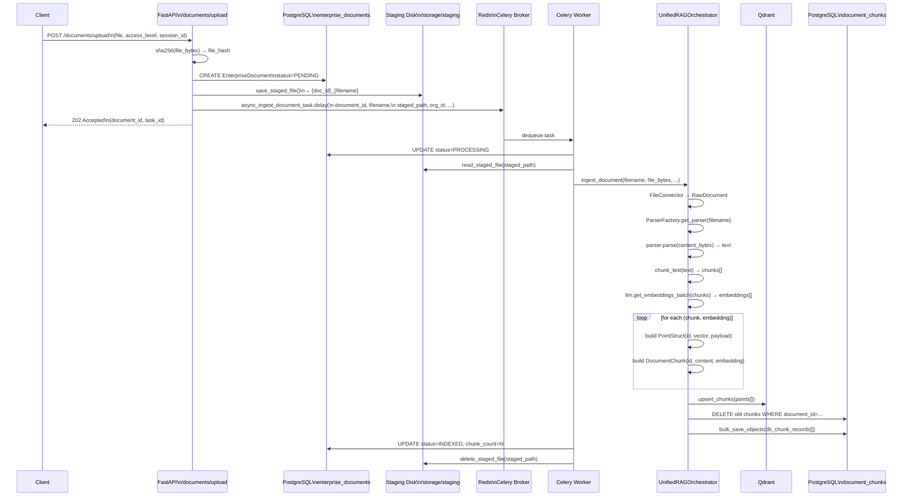
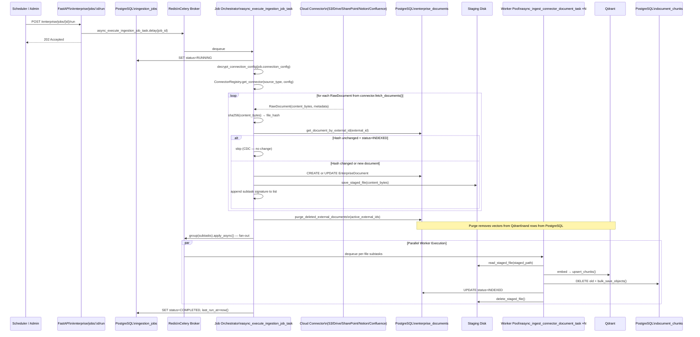
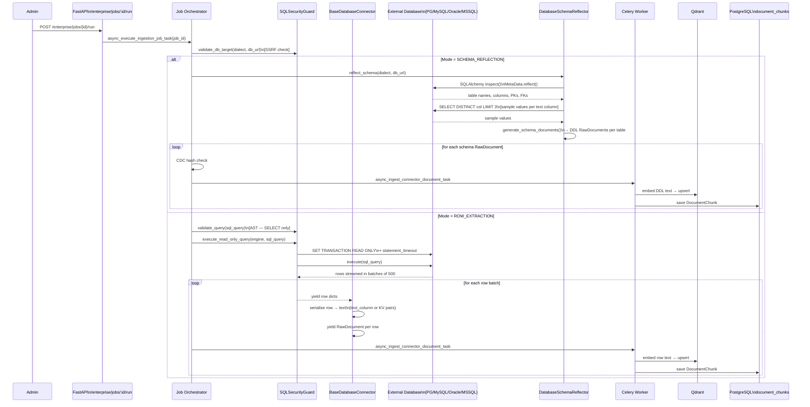
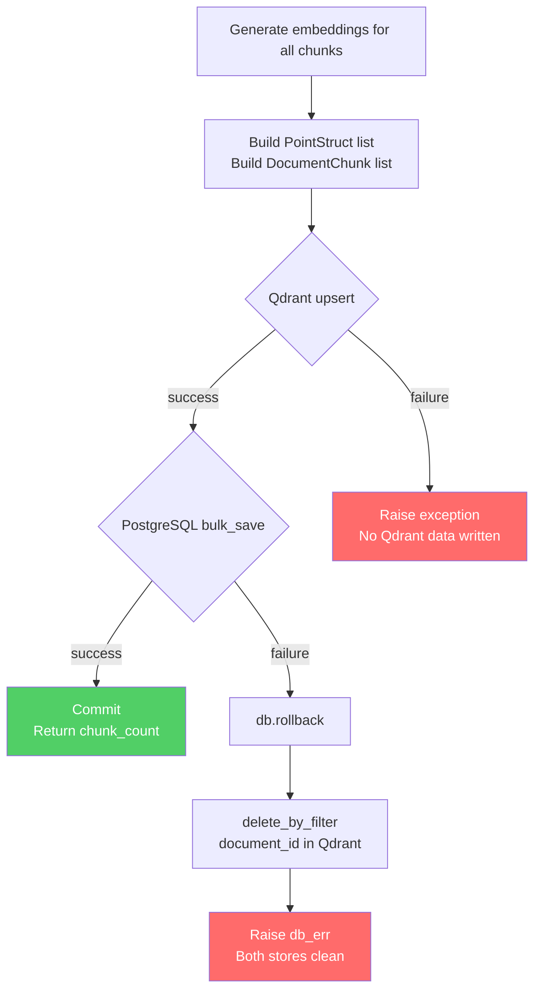

# Ingestion Architecture Diagrams

> Mermaid diagrams for the multi-tenant RAG system ingestion layer.

---

## 1. High-Level Ingestion Architecture

```mermaid
graph TD
    subgraph API["FastAPI Application"]
        U[POST /documents/upload]
        J[POST /enterprise/jobs/:id/run]
    end

    subgraph Queue["Async Layer (Celery + Redis)"]
        T1[async_ingest_document_task]
        T2[async_execute_ingestion_job_task]
        T3[async_ingest_connector_document_task\n×N parallel workers]
    end

    subgraph Connectors["Source Connectors"]
        FC[FileConnector]
        S3[S3Connector]
        GD[GoogleDriveConnector]
        SP[SharePointConnector]
        NO[NotionConnector]
        CO[ConfluenceConnector]
        DB[BaseDatabaseConnector\nPostgreSQL · MySQL · Oracle · MSSQL]
    end

    subgraph Orchestrator["UnifiedRAGOrchestrator"]
        EX[extract_text_from_file\nParserFactory]
        CH[chunk_text]
        EM[get_embeddings_batch\nLLMService]
        DW[Dual-Write]
    end

    subgraph Storage["Persistent Storage"]
        QD[(Qdrant\nHNSW Vector Index)]
        PG[(PostgreSQL\nDocumentChunk + pgvector)]
        PGMETA[(PostgreSQL\nEnterpriseDocument\nIngestionJob)]
        DISK[/app/storage/staging\nClaim-Check Disk]
    end

    U --> T1
    J --> T2
    T2 --> T3

    T1 --> FC --> Orchestrator
    T2 --> S3 & GD & SP & NO & CO & DB
    S3 & GD & SP & NO & CO & DB --> T3
    T3 --> Orchestrator

    Orchestrator --> EX --> CH --> EM --> DW
    DW --> QD
    DW --> PG
    T1 & T2 & T3 --> DISK
    T2 --> PGMETA
```

---

## 2. File Upload Flow



---

## 3. Cloud Storage Ingestion Flow (Connector Job)



---

## 4. Database Ingestion Flow



---

## 5. Dual-Write Consistency & Rollback


