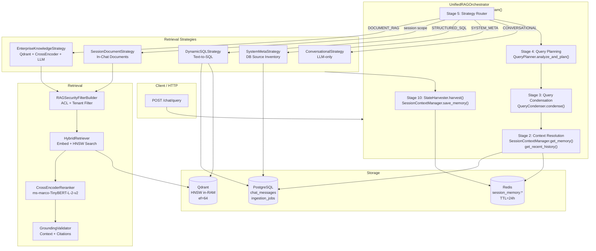
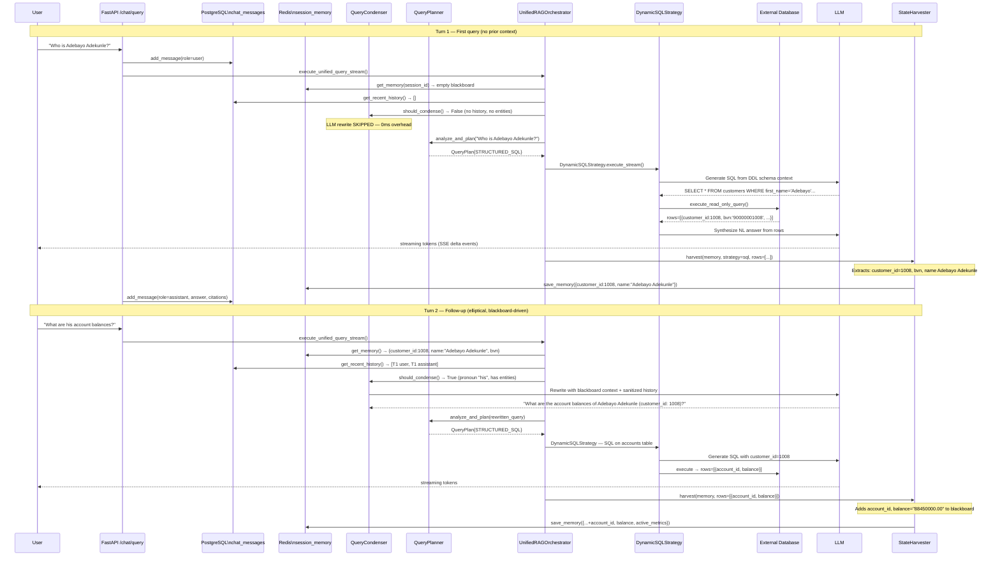
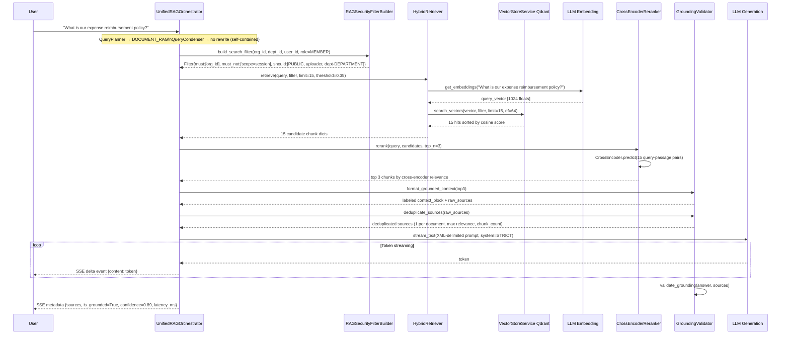
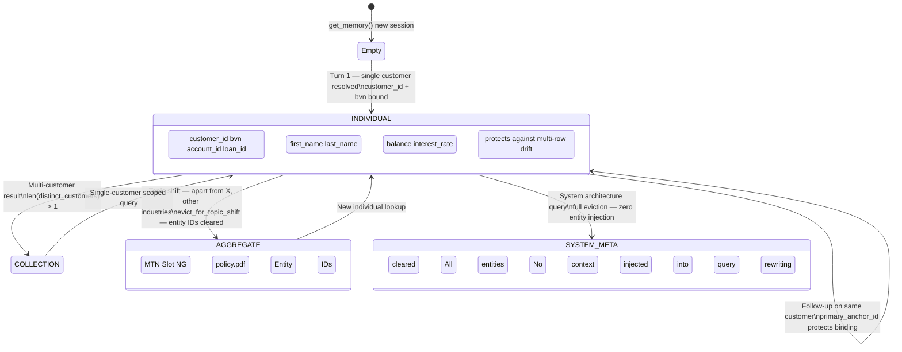

# Retrieval Architecture Diagrams

> Mermaid diagrams for the multi-tenant RAG system retrieval layer.

---

## 1. High-Level Retrieval Architecture

---

## 2. Multi-Turn Retrieval Flow (Blackboard-Driven)

---

## 3. Document Retrieval Flow (EnterpriseKnowledgeStrategy)

---

## 4. Database Retrieval Flow (Text-to-SQL with Self-Correction)

```mermaid
sequenceDiagram
    participant User
    participant SQL as DynamicSQLStrategy
    participant QD as Qdrant Schema DDL
    participant Agent as DynamicSQLAgent
    participant LLM as LLM SQL Generation
    participant Guard as SQLSecurityGuard AST
    participant ExtDB as External Database
    participant GenLLM as LLM Synthesis

    User->>SQL: "How many active loans are above 10M?"
    Note over SQL: QueryPlanner → STRUCTURED_SQL

    SQL->>QD: scroll DDL schema chunks\n[org_id, source_type=POSTGRES_DB]
    QD-->>SQL: DDL context (tables, columns, FK, sample values)

    SQL->>Agent: generate_and_execute_sql(\n  user_query, schema_ctx, dialect=postgresql, url\n)

    rect rgb(30,50,80)
        Note over Agent,ExtDB: Attempt 1
        Agent->>LLM: SQL generation prompt\n[schema context + user query]
        LLM-->>Agent: SELECT COUNT(*) FROM loans WHERE status='ACTIVE' AND amount>10000000

        Agent->>Guard: validate_query(sql) — AST parse
        alt SELECT statement — passes
            Guard->>ExtDB: SET TRANSACTION READ ONLY
            Guard->>ExtDB: execute(sql, timeout=15000ms)
            ExtDB-->>Agent: rows=[{count:47}] → SUCCESS
        else Non-SELECT blocked
            Guard-->>Agent: InsecureQueryError → security_violation
        end
    end

    rect rgb(60,30,30)
        Note over Agent,ExtDB: Attempt 2 (on error)
        Agent->>LLM: Retry prompt\n[previous SQL + error diagnostic]
        LLM-->>Agent: corrected SQL
        Agent->>Guard: validate again
        Guard->>ExtDB: execute
        ExtDB-->>Agent: rows → SUCCESS
    end

    Agent-->>SQL: {status:success, sql, rows, row_count, columns}

    SQL->>GenLLM: stream_text(synthesis_prompt:\n  query + executed_sql + 47 rows)
    loop Token streaming
        GenLLM-->>SQL: token
        SQL-->>User: SSE delta event
    end

    SQL-->>User: SSE metadata {source: {sql_query, row_count:47, db_name}}
```

---

## 5. Blackboard Lifecycle (SessionWorkingMemory)

